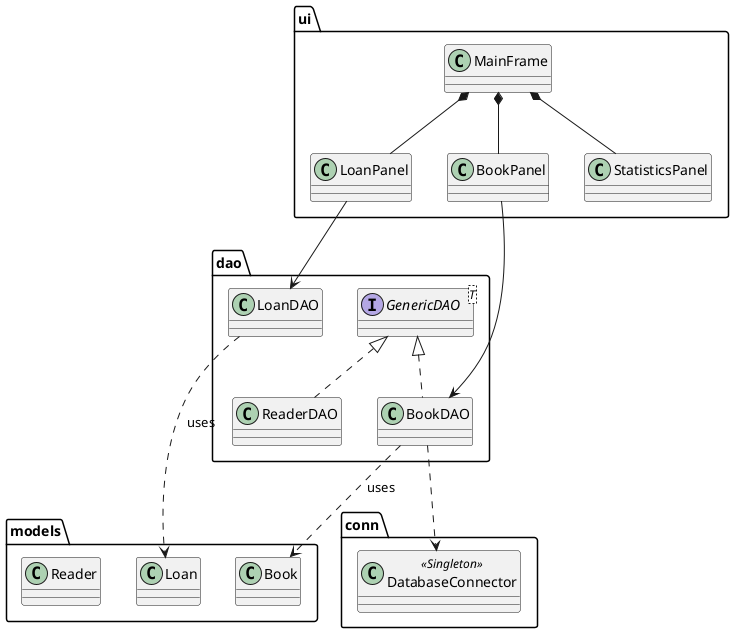
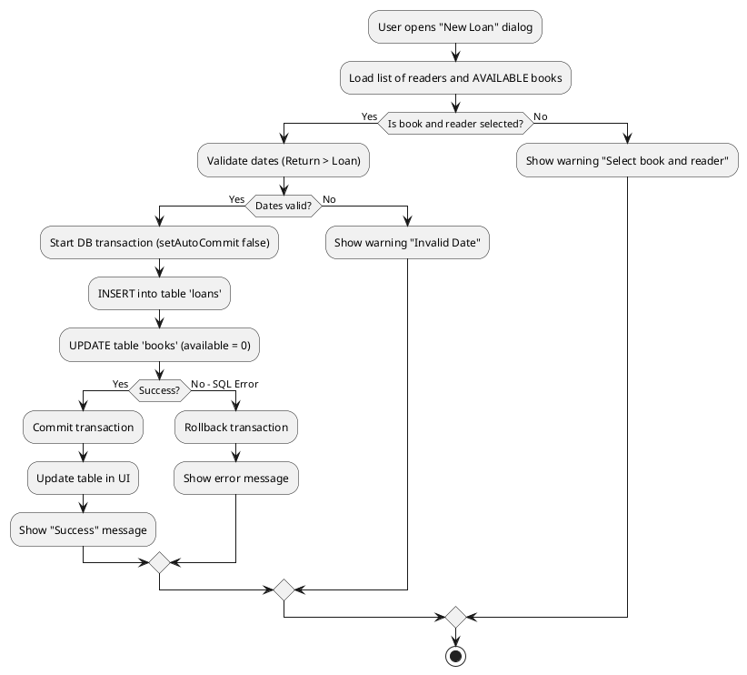
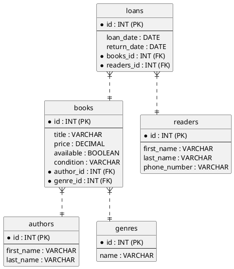

# Technical Documentation: Library Database Manager

**Author:** Zdeněk Relich  
**Contact:** relich@post.cz  
**School:** Střední průmyslová škola elektrotechnická Ječná 30, Praha 2  
**Date:** 7th January, 2026  
**Project Type:** School Project
---
## 1. Introduction and Requirements Specification
### 1.1 Project Goal
The goal of this project is to create a desktop application which connects to a database servers and works with stored data.
### 1.2 Functional Requirements
The application meets the following requirements defined by the assignment:
* **Book Management:** The user can add, edit, and delete books. The system tracks the title, price, condition (NEW, USED, etc.), author, and genre for each book.
* **Author and Genre Management:** Ability to manage authors and genres independently of books (lookup tables).
* **Reader Management:** Management of readers including contact details.
* **Loan System:**
    * Create a new loan (only if the book is available).
    * Return a book (close the loan).
    * Automatic update of the book's availability status upon borrowing/returning.
* **Statistics:** A dashboard displaying the total number of books, inventory value, number of readers, and a list of overdue loans.
* **Data Import:** Ability to batch import books from JSON format.
### 1.3 Non-functional Requirements
* **Platform:** Java SE (version 17+) using Swing for the GUI.
* **Data:** MySQL Relational Database.
* **Architecture:** Utilization of DAO (Data Access Object) and Singleton design patterns.
* **Security:** Use of `PreparedStatement` to prevent SQL Injection.
---
## 2. Application Architecture
The application is designed using a layered architecture that separates data (Model), data access (DAO), and the user interface (View/UI).
### 2.1 Design Patterns Used
* **DAO (Data Access Object):** Separates database logic from the rest of the application. Each entity (`Book`, `Reader`, `Loan`, etc.) has its own DAO class implementing the `GenericDAO` interface.
* **Singleton:** The `DatabaseConnector` class is a singleton to ensure only one database connection instance exists throughout the application.
* **MVC (Model-View-Controller) Principles:** Although Swing is not strictly MVC, the application separates models (`models.*`), logic (`dao.*`, `services.*`), and views (`ui.*`).
### 2.2 UML Class Diagram (Structural View)
Below is a simplified schema of the main classes and their relationships.

---
## 3. Application Behavior (Behavioral Diagrams)
### 3.1 Loan Creation Process (Activity Diagram)
The following diagram describes the internal system process when a librarian attempts to create a new loan. The system ensures transactional processing (inserting the loan and updating book availability happen atomically).

---
## 4. Database Model (E-R Diagram)
The application uses a MySQL relational database. The structure is designed in 3rd Normal Form.
### 4.1 Database Schema

### 4.2 Views
The application uses SQL Views to simplify logic:
* active_loans: Joins loans, books, and readers tables and calculates days_overdue.
* library_statistics: Aggregates data for the dashboard (total books, inventory value, etc.).
---
## 5. Interfaces, Dependencies, and Import
### 5.1 Third-party Libraries (Dependencies)
The project depends on the following external libraries:
* MySQL Connector/J (version 8.3.0)
  * Purpose: JDBC driver for communication with the MySQL database.
  * License: GPLv2.
* Jackson Databind & Core (version 2.17.0)
  * Purpose: Parsing JSON files for book import.
  * License: Apache License 2.0.
* Jackson Datatype JSR310
  * Purpose: Support for LocalDate types in JSON.
### 5.2 Import Schema (JSON)
The application allows importing books using a JSON file. The file must contain an array of objects with the following structure:
* Mandatory fields: title, price, condition, author (first/last name), genre (name).  
Example of a valid data.json file:
```JSON
[
  {
    "title": "RUR",
    "price": 250.00,
    "available": true,
    "condition": "USED",
    "author": {
      "firstName": "Karel",
      "lastName": "Čapek"
    },
    "genre": {
      "name": "Sci-Fi"
    }
  }
]
```
---
## 6. Configuration, Installation, and Startup
### 6.1 Configuration
Database connection configuration is stored in the conf/config.json file located in the application's root directory. Format of conf/config.json:
```JSON
{
  "dbUrl": "jdbc:mysql://domain|ip:3306/library",
  "dbUser": "yourUsername",
  "dbPassword": "yourPassword"
}
```
### 6.2 Installation Procedure
* Database:
  1. Install MySQL Server (version 8.0+).
  2. Run the included SQL script *generation-script.sql*, which creates the library database, tables, and views.
* Application:
  1. Ensure Java JDK 17 or newer is installed. 
* Startup:
  1. Double-click the *library-database-manager.jar*.
  2. If the app doesn't start, press `Windows` + `R`, type `cmd`, press `Enter`, navigate yourself to the application's root folder, type `javaw -jar D1-library-database-main.jar`.
---
## 7. Error States and Troubleshooting
The application uses a custom exception exceptions. DbException which wraps the standard SQLException.

| Error Code/Type      | Description                                              | Solution                                                                                 |
|----------------------|----------------------------------------------------------|------------------------------------------------------------------------------------------|
| Configuration Error  | Application displays "Configuration error" upon startup. | Check the existence and syntax of the conf/config.json file.                             |
| Connection Refused   | Cannot connect to the DB.                                | Verify that the MySQL server is running and credentials in config are correct.           |
| Constraint Violation | Cannot delete author/genre/book/reader.                  | The record is in use. Delete dependencies first (e.g., books before author).             |
| Import Failed        | Error during JSON import.                                | Check the log in the import window. A mandatory attribute is likely missing in the JSON. |
---
## 8. Testing and Validation
Functionality was verified through manual integration testing.
### 8.1 Test Scenarios
* Connection Test: Application does not start without a valid config (Successful). 
* CRUD Operations: Creating a book, editing price, deleting (Successful).
* Loan Transactions: Creating a loan changes the book's available attribute to false (Successful).
* Cannot borrow a book that is already on loan (Successful).
* Input Validation: Cannot save a book without a title or with a negative price (Successful).
* Reader's phone number accepts only digits and plus sign (Successful).
Further testing will be done by external tester using provided Test cases.
---
## 9. Project Summary and Legal Aspects
### 9.1 Summary
The project successfully fulfills the assignment to create a functional library management system.
The architecture is modular and ready for further expansion (e.g., loan history or user authentication).
### 9.2 Legal Aspects
This software was created as a school project and is intended solely for educational purposes.  
Copyright for the source code belongs to the author.  
The use of third-party libraries is governed by their respective licenses (GPL for MySQL, Apache 2.0 for Jackson).  
The application does not store any sensitive personal data requiring GDPR compliance (reader data is fictitious/demonstrative).  
---
### 10. Known Issues and Version
Version: 1.0.0  
Known Issues:
- The database password is stored in plain text in the JSON file.
- Deleting an entity which has a bond causes an integrity error (implementation of "soft delete" would be appropriate).